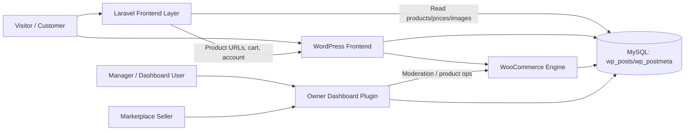

# ProjectPrain — Styliiiish System Brain (WordPress + Laravel)

## 1) Executive Summary

Styliiiish runs as a **hybrid architecture**:

- **WordPress + WooCommerce** = source of truth (products, users, checkout, account, marketplace flows).
- **Laravel app (`laravel_home`)** = fast custom storefront/landing layer for home/shop/ads experiences.
- **Custom WP plugin (`owner-dashboard`)** = operations layer for managers and customer-vendor workflows.

In practice:

1. Laravel reads Woo data directly from WordPress tables (`wp_posts`, `wp_postmeta`).
2. Laravel UI routes users back to WordPress product/account/cart/wishlist pages for transaction completion.
3. WordPress plugin handles internal operations: product moderation, owner dashboard, and marketplace seller tools.

---

## 2) High-Level Topology

---

## 3) Repository Layout (Important Parts)

- Root = WordPress install.
- `laravel_home/` = Laravel application used as custom presentation layer.
- `wp-content/plugins/owner-dashboard/` = custom operations + marketplace management plugin.

Core files for architecture understanding:

- Laravel routes/query logic: `laravel_home/routes/web.php`
- Laravel product model: `laravel_home/app/Models/WooProduct.php`
- Laravel views: `laravel_home/resources/views/home.blade.php`, `shop.blade.php`, `ads-landing.blade.php`
- Laravel DB config: `laravel_home/config/database.php`
- Plugin bootstrap: `wp-content/plugins/owner-dashboard/owner-dashboard.php`
- Plugin role/mode behavior: `wp-content/plugins/owner-dashboard/functions.php`
- Vendor moderation flow: `wp-content/plugins/owner-dashboard/vendor-products.php`
- Product management AJAX core: `wp-content/plugins/owner-dashboard/modules/shared/ajax/manage-products-ajax.php`

---

## 4) Laravel Layer — What It Does

### 4.1 Routes + Data Access

`laravel_home/routes/web.php` defines the key public routes:

- `GET /`:
  - Fetches latest products from WP tables.
  - Computes basic stats (total products, sale products, min/max price).
  - Caches results (`Cache::remember`) for 300 seconds.

- `GET /shop`:
  - Supports search and sorting (`newest`, `price_asc`, `price_desc`).
  - Returns HTML view by default.
  - Returns JSON when request expects AJAX/JSON.
  - Paginates products (16/page).

- `GET /ads`:
  - Optimized ads landing products (latest 12).
  - Includes cached total product count.

### 4.2 Data Source Strategy

Laravel is not using native WooCommerce APIs here; it queries directly:

- `wp_posts` for product posts and attachments.
- `wp_postmeta` for `_price`, `_regular_price`, `_sale_price`, `_thumbnail_id`.

This gives speed/flexibility but creates tight coupling to WP schema/meta conventions.

### 4.3 Laravel Views Responsibility Split

- `home.blade.php`: branded home page + featured products + links to WP actions.
- `shop.blade.php`: dynamic storefront with AJAX fetch to `/shop` and client-side rendering.
- `ads-landing.blade.php`: campaign page with conversion-focused product cards.

These views intentionally route purchase/account actions to WordPress endpoints (product pages, cart, wishlist, my-account).

---

## 5) WordPress + WooCommerce Layer — What It Owns

WordPress/WooCommerce remains authoritative for:

- Product persistence and metadata.
- User account, wishlist, cart, checkout.
- Product URLs and canonical product pages.
- Taxonomies, media attachments, and Woo operational state.

This means Laravel is a **read-heavy presentation shell**, while WP/Woo is **transaction/ownership core**.

---

## 6) Owner Dashboard Plugin — Business Operations Core

Plugin: `wp-content/plugins/owner-dashboard/owner-dashboard.php`

### 6.1 Core Capabilities

- Registers dashboard shortcode: `[owner_dashboard]`.
- Loads operations modules:
  - `vendor-products.php` (customer dresses review/moderation)
  - `orders.php`, `stats.php`, `email.php`
  - Manage products modules in `modules/manage-products/*`
- Enqueues dashboard assets only for `owner-dashboard` page.

### 6.2 Access Model

Based on helper functions and settings:

- `manager`
- `dashboard`
- `marketplace`

User type classification is handled in `includes/helpers.php` via `wf_od_get_user_type()` using stored manager/dashboard IDs.

### 6.3 Customer-Seller Flow

In `functions.php` and manage products modules:

- Customers can upload/manage own dresses (`my-dresses`).
- Role/capability tuning allows uploads while limiting backend admin access.
- Shared UI script used in both manager and user modes.

### 6.4 Moderation Flow (Critical)

In `vendor-products.php`:

- Pulls customer-submitted products (`pending`, `draft`) excluding managers.
- Manager/dashboard can approve/reject via AJAX.
- Approve ⇒ product published.
- Reject ⇒ draft + structured reject reason metadata.
- Sends notification email to product author with moderation result.

### 6.5 Product Operations Engine

`modules/shared/ajax/manage-products-ajax.php` is the largest operational core:

- Product create from templates (owner template vs user template).
- Attributes/taxonomy handling.
- Rich AJAX-based CRUD-like product management behavior.

---

## 7) End-to-End User Journeys

### 7.1 Buyer Journey (Hybrid)

1. Buyer lands on Laravel (`/`, `/shop`, `/ads`).
2. Laravel loads products from WP DB.
3. Buyer clicks product action.
4. User is directed to WordPress product URL.
5. Cart/checkout/account complete in WooCommerce.

### 7.2 Seller Journey (Marketplace User)

1. Seller logs in WordPress account.
2. Opens `my-dresses` flow (plugin UI).
3. Adds/edits product in user mode (usually draft/pending).
4. Manager reviews in owner dashboard.
5. If approved, product becomes published/market-visible.

### 7.3 Manager/Operations Journey

1. Manager accesses `owner-dashboard`.
2. Uses modules for:
   - Product moderation
   - Product management
   - Orders / stats / email functions
3. Workflow actions update Woo product states and metadata.

---

## 8) Current Coupling/Dependency Map

### 8.1 Laravel → WordPress Couplings

- Hard dependency on WP table names (`wp_posts`, `wp_postmeta`).
- Hard dependency on Woo meta keys (`_price`, `_regular_price`, `_sale_price`, `_thumbnail_id`).
- UI link dependency on WP URL structure (`/product/{slug}`, `/cart`, `/my-account`, `/wishlist`).

### 8.2 Plugin → WooCommerce Couplings

- Uses Woo product post type and product metadata directly.
- Relies on WP roles/capabilities and custom settings IDs.
- Uses AJAX endpoints for all key product management actions.

---

## 9) Risks & Technical Debt (Important)

### 9.1 Configuration/Security Risk (High)

`laravel_home/config/database.php` currently contains:

- Environment-specific direct `wp-config.php` reading from an absolute server path.
- A hardcoded MySQL connection block.

This is a significant security and portability risk.

### 9.2 Schema Coupling Risk

Because Laravel reads WP internals directly (not API contracts), any major schema/meta behavior changes can break storefront logic.

### 9.3 Operational Complexity Risk

Large AJAX-heavy plugin logic concentrated in one long file (`manage-products-ajax.php`) increases maintenance/debugging complexity.

---

## 10) Hardening Backlog (Recommended Order)

1. **Move all DB credentials to env only**:
   - Laravel `config/database.php` should only use `env()` values.
   - No hardcoded secrets or absolute production-path parsing.

2. **Document URL contract** between Laravel views and WP routes:
   - Product permalink format.
   - Account/cart/wishlist endpoints.

3. **Extract query/service layer in Laravel**:
   - Move SQL from route closures into service classes/repositories.

4. **Split plugin AJAX core**:
   - Break `manage-products-ajax.php` into domain-focused files.

5. **Add smoke checks** for cross-layer integrity:
   - Product query health.
   - Key endpoint availability.
   - Required WP meta keys existence.

---

## 11) Runtime/Deployment Notes

- Laravel runtime stability depends on Composer vendor integrity and cached config/routes state.
- If server errors reference missing classes/services:
  - `composer install`/`composer update` consistency is critical.
  - Clear/rebuild Laravel caches after deploy.

Because project is hybrid in one repo, deployment should treat:

- WordPress runtime files,
- Laravel app files,
- and dependency folders

as separate lifecycle concerns.

---

## 12) Fast Onboarding Checklist (For Any Future Assistant/Dev)

1. Read `laravel_home/routes/web.php` first.
2. Read `laravel_home/resources/views/shop.blade.php` for AJAX storefront behavior.
3. Read `wp-content/plugins/owner-dashboard/owner-dashboard.php` to understand module loading.
4. Read `vendor-products.php` for moderation workflow.
5. Read `modules/shared/ajax/manage-products-ajax.php` only after understanding role model.
6. Verify database config safety before any push/deploy.

---

## 13) Single-Sentence System Truth

**Styliiiish is a WordPress/WooCommerce commerce core with a Laravel presentation accelerator and a custom owner-dashboard plugin operating as the internal marketplace control plane.**

---

## 14) Future Updates Policy for This File

When architecture changes, update this file in this order:

1. Topology section
2. Route/flow section
3. Coupling map
4. Risk/backlog section

Keep this document as the first reference before making integration changes.
test